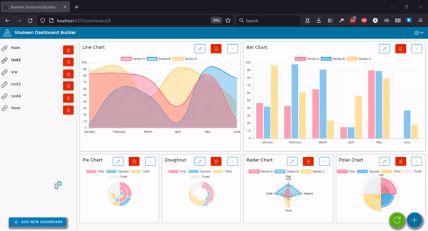
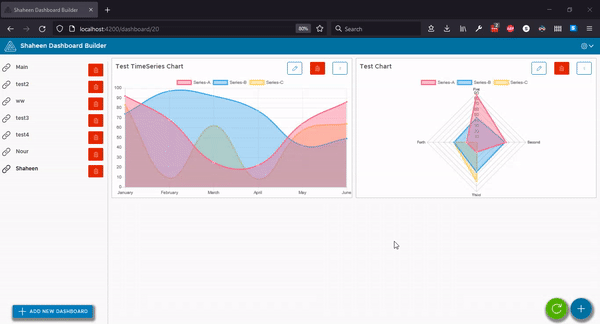
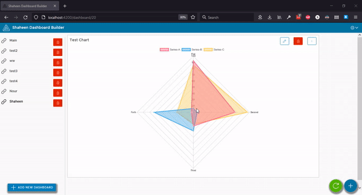

# Generic Dashboard Builder

## Start ASP Core Project
- Start by applying db migration through PM
- `PM> Add-Migration initial-migration`
- `PM> Update-Database`
- Run the project: `http://localhost:8080/`

## Start Angular
- Install dependencies first by running `npm i`
- Run `ng serve -o` for a dev server. 
- Navigate to `http://localhost:4200/`. 
- Start Building!

Please keep in mind that the backend is a prototype which generates random data, Data controller is considered to be only example of the rest interface.\
So feel free to implement any custom data endpoints to produce the same DTO.

## Demo

